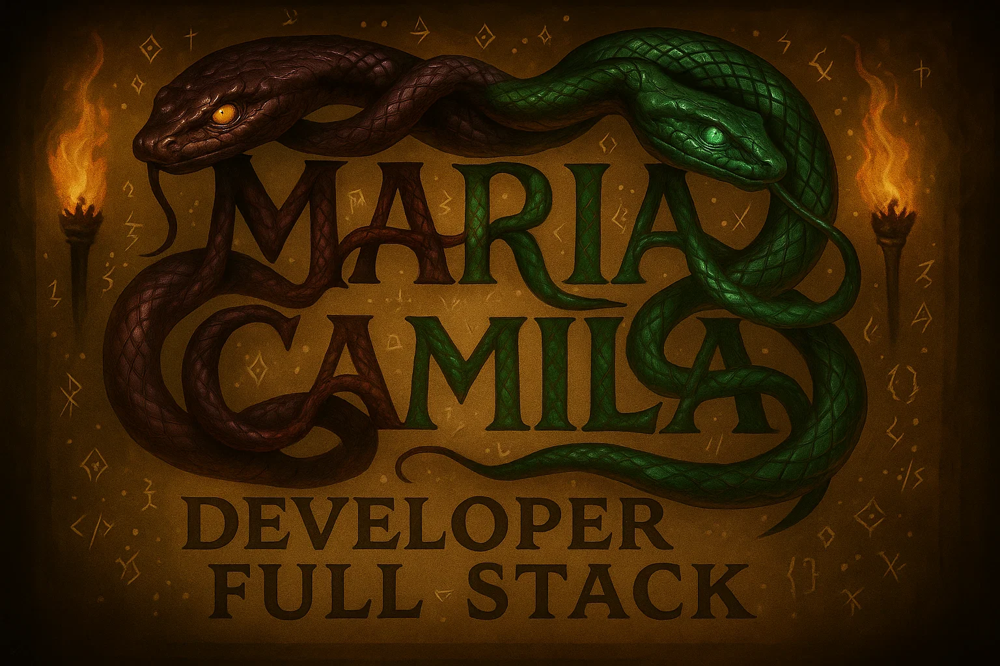
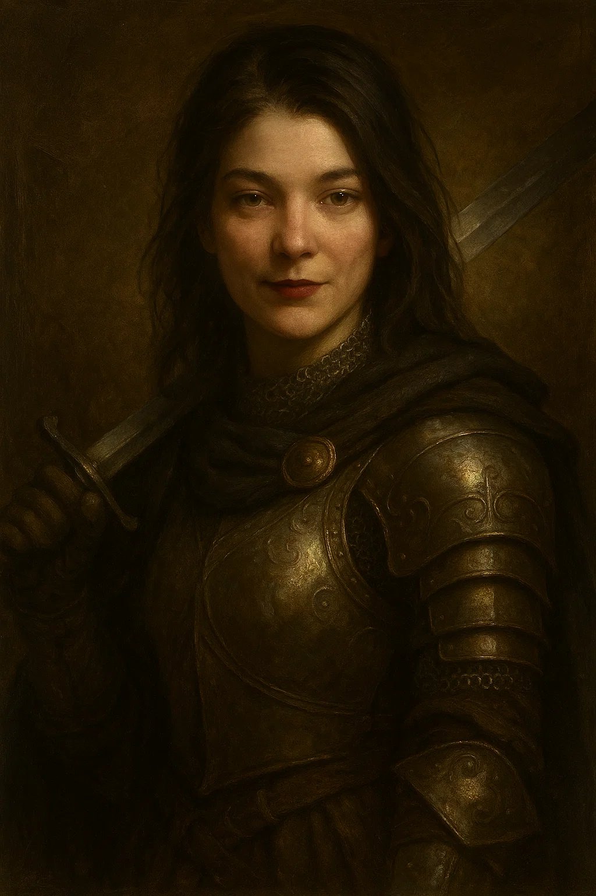

# Olá, eu sou a Maria Camila!🛡️⚔️

  

  

A tecnologia é a força que me inspira a seguir em frente, todos os dias. Sou apaixonada por aprender, criar e transformar ideias em soluções que realmente fazem a diferença. Para mim, cada projeto é uma batalha vencida, cada desafio é uma oportunidade de evolução, e cada erro é apenas mais uma lição no caminho. Ser desenvolvedora é mais do que uma profissão: é um propósito, uma paixão e a minha forma de deixar uma marca no mundo. 🛡️⚔️🔥

