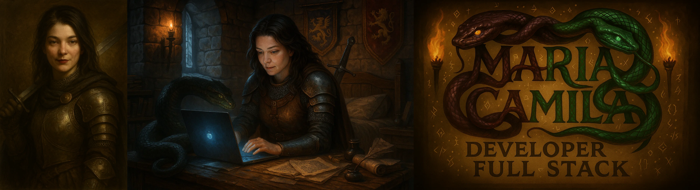

  

  

---

<h2 align="center">
  🚀 Transformando tecnologia em soluções que impactam o mundo!
</h2>

  <em>
    A tecnologia é minha aliada diária. Sou movida pela paixão de aprender, criar e inovar. Meu compromisso é transformar desafios em oportunidades e ideias em soluções reais. Cada projeto é uma conquista, cada bug é uma chance de evoluir. Ser desenvolvedora é meu propósito, minha paixão e a maneira que encontrei de deixar minha marca no mundo digital. <strong>Vamos construir o futuro juntos?</strong> 🛡️⚔️🔥
  </em>

<h2 align="center">🧠 Meu Arsenal de Habilidades 🛡️</h2>

### 🔖 Linguagens de Marcação

### 💻 Linguagens de Programação

### ⚙️ Frameworks & Bibliotecas

### 🗄️ Bancos de Dados

### 🛠️ Ferramentas de Desenvolvimento

### 🎨 Design & UX/UI

### 📊 Data Science & Machine Learning

---

<h2 align="center">🌟 Vamos construir juntos?</h2>

  <b>Me envie uma mensagem, conecte-se ou acompanhe meus projetos!</b>

  
  

---

  <em>
    
      “A cada linha de código, um novo horizonte. Vem comigo nessa jornada!” 
    
  </em>

